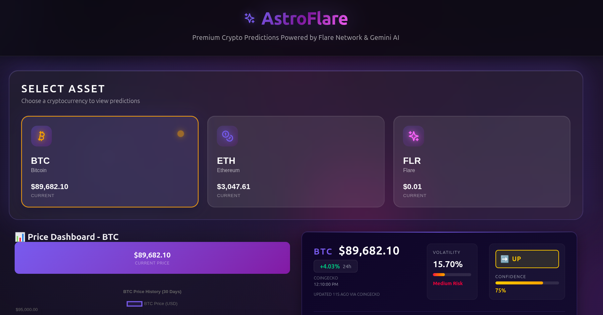
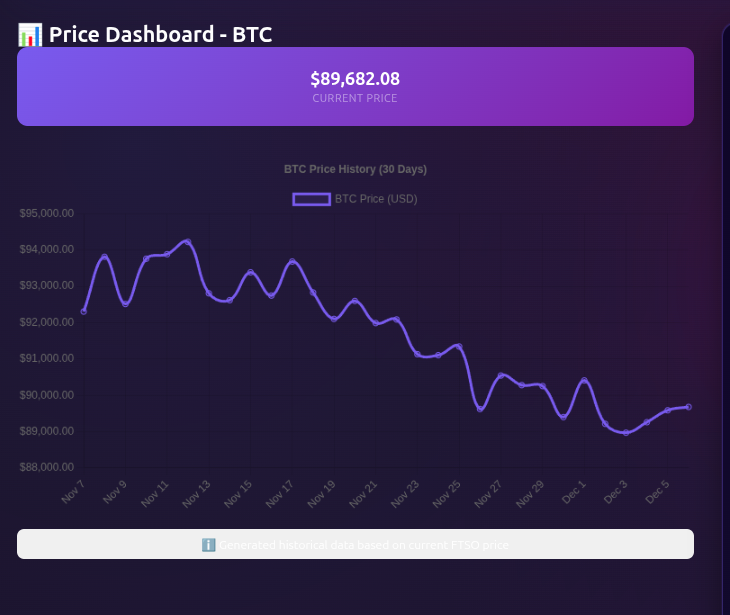
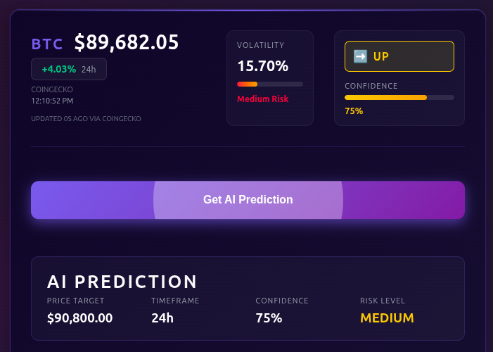
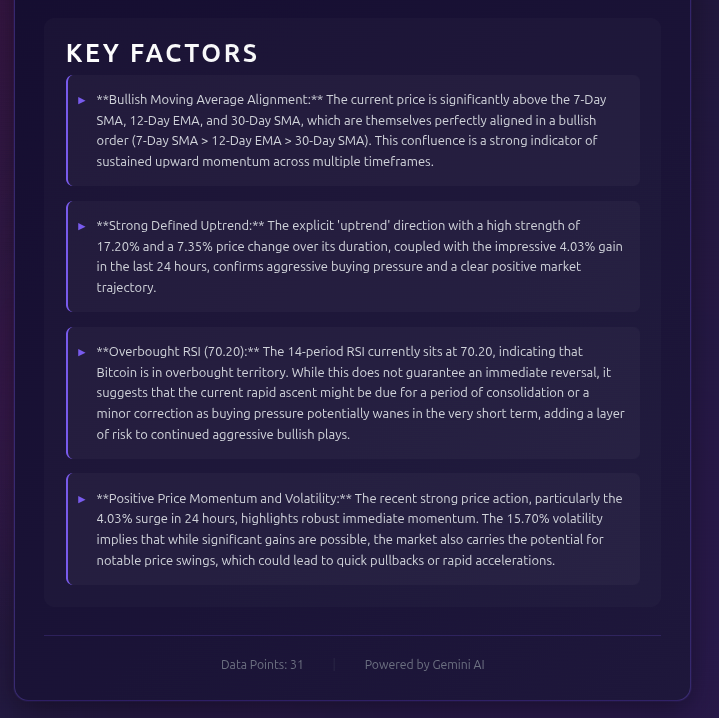
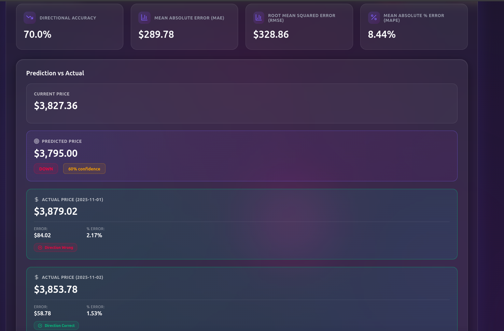
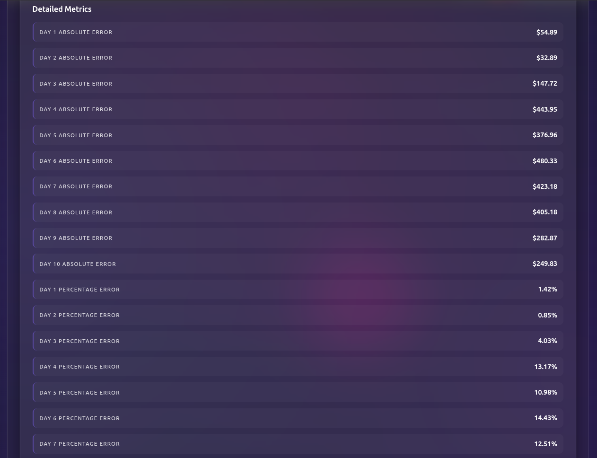
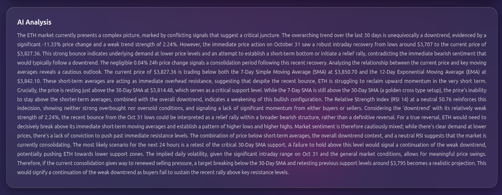

# 🚀 AstroFlare

<div align="center">

**Premium Crypto Predictions Powered by Flare Network & Gemini AI**

[](https://opensource.org/licenses/MIT)
[](https://nodejs.org/)
[](https://reactjs.org/)

*A futuristic, 2025-grade FinTech dashboard for cryptocurrency price prediction and backtesting*

</div>

---

## 📖 Table of Contents

- [Overview](#-overview)
- [Features](#-features)
- [Screenshots](#-screenshots)
- [Technology Stack](#-technology-stack)
- [Architecture](#-architecture)
- [Installation](#-installation)
- [Configuration](#-configuration)
- [Usage Guide](#-usage-guide)
- [API Documentation](#-api-documentation)
- [Backtesting System](#-backtesting-system)
- [Project Structure](#-project-structure)
- [Contributing](#-contributing)
- [License](#-license)

---

## 🎯 Overview

**AstroFlare** is a premium Web3 cryptocurrency price prediction platform that combines the power of Flare Network's decentralized data oracles with Google's Gemini AI to deliver accurate, real-time price forecasts. Built with a modern, futuristic UI featuring glassmorphism, vibrant gradients, and smooth animations, AstroFlare provides both live predictions and comprehensive backtesting capabilities.

### Key Highlights

- 🔮 **AI-Powered Predictions**: Leverages Google Gemini AI for sophisticated market analysis
- 📊 **Multi-Source Data**: Aggregates data from Flare Network (FTSO, FAssets, FDC) and CoinGecko
- 🧪 **Backtesting System**: Test prediction accuracy against historical data
- 🎨 **Premium UI**: Modern, glassmorphic design with smooth animations
- ⚡ **Real-Time Updates**: Live price feeds with automatic refresh
- 📈 **Technical Indicators**: RSI, SMA, EMA, volatility, and trend analysis

---

## ✨ Features

### Core Functionality

1. **Live Price Dashboard**
   - Real-time cryptocurrency prices (BTC, ETH, FLR)
   - 24-hour price change indicators
   - Historical price charts (30-day view)
   - Automatic data refresh every 30 seconds

2. **AI Prediction Engine**
   - Short-term price forecasts (24h, multi-day)
   - Direction predictions (UP/DOWN/NEUTRAL)
   - Confidence scoring (0-100%)
   - Risk level assessment (LOW/MEDIUM/HIGH)
   - Detailed market analysis with technical insights
   - Key factors influencing predictions

3. **Backtesting System**
   - Test predictions against historical data
   - Accuracy metrics: MAE, RMSE, MAPE, Directional Accuracy
   - Multi-day prediction support
   - Detailed error analysis per day
   - Comparison of predicted vs. actual prices

4. **Technical Analysis**
   - Moving Averages (SMA 7, SMA 30, EMA 12)
   - Relative Strength Index (RSI)
   - Volatility calculations
   - Trend strength indicators
   - Momentum analysis

5. **Premium User Interface**
   - Glassmorphism design with blurred backgrounds
   - Vibrant neon gradients (purple, blue, pink)
   - Smooth animations powered by Framer Motion
   - Responsive design (desktop, tablet, mobile)
   - High-contrast typography for readability
   - Custom scrollbars and micro-interactions

---

## 📸 Screenshots

### Dashboard Overview

*Main dashboard showing asset selection, price dashboard, and AI predictions*

### Price Dashboard

*Real-time price display with 30-day historical chart showing price trends*

### AI Prediction Card

*Comprehensive AI prediction panel with price target, confidence, risk level, and detailed analysis*

### Key Factors Analysis

*Detailed breakdown of key market factors influencing the prediction*

### Backtesting Results

*Backtesting interface showing accuracy metrics, prediction vs. actual comparison, and detailed error analysis*

### Detailed Metrics

*Day-by-day breakdown of absolute and percentage errors*

### AI Analysis

*In-depth market analysis generated by Gemini AI, including technical indicators and market sentiment*

---

## 🛠 Technology Stack

### Frontend
- **React 18.2** - UI framework
- **Framer Motion 10.18** - Animations and transitions
- **Chart.js 4.4** - Data visualization
- **Lucide React 0.294** - Modern icon library
- **Axios 1.6** - HTTP client

### Backend
- **Node.js 18+** - Runtime environment
- **Express 4.18** - Web framework
- **Ethers.js 6.9** - Blockchain interaction
- **Google Generative AI 0.2** - Gemini API integration
- **Axios 1.6** - HTTP requests
- **Node-cron 3.0** - Scheduled tasks

### Blockchain & Data Sources
- **Flare Network** - Decentralized oracle network
  - FTSO (Flare Time Series Oracle)
  - FAssets
  - FDC (Flare Data Connector)
- **CoinGecko API** - Historical price data
- **Solidity** - Smart contracts

### AI & Analytics
- **Google Gemini 2.5 Flash** - AI prediction engine
- **Technical Indicators** - Custom calculation library

---

## 🏗 Architecture

### System Architecture

```
┌─────────────────────────────────────────────────────────────┐
│                        Frontend (React)                      │
│  ┌──────────────┐  ┌──────────────┐  ┌──────────────┐      │
│  │ Asset Select │  │ Price Chart  │  │ AI Prediction│      │
│  └──────────────┘  └──────────────┘  └──────────────┘      │
│  ┌──────────────────────────────────────────────────────┐  │
│  │           Backtesting Panel & Results                │  │
│  └──────────────────────────────────────────────────────┘  │
└───────────────────────────┬─────────────────────────────────┘
                             │ HTTP/REST API
┌─────────────────────────────▼─────────────────────────────────┐
│                    Backend (Node.js/Express)                   │
│  ┌──────────────┐  ┌──────────────┐  ┌──────────────┐      │
│  │ Price Routes │  │ Prediction   │  │ Backtesting   │      │
│  │              │  │ Routes       │  │ Routes        │      │
│  └──────────────┘  └──────────────┘  └──────────────┘      │
│  ┌──────────────────────────────────────────────────────┐  │
│  │              Service Layer                            │  │
│  │  ┌──────────┐  ┌──────────┐  ┌──────────┐         │  │
│  │  │ FTSO     │  │ Gemini   │  │ CoinGecko │         │  │
│  │  │ Service  │  │ Service  │  │ Service   │         │  │
│  │  └──────────┘  └──────────┘  └──────────┘         │  │
│  └──────────────────────────────────────────────────────┘  │
└───────────────────────────┬─────────────────────────────────┘
                             │
        ┌────────────────────┼────────────────────┐
        │                    │                    │
┌───────▼──────┐    ┌───────▼──────┐   ┌────────▼────────┐
│ Flare Network│    │ Gemini API    │   │ CoinGecko API    │
│ (FTSO/FDC)  │    │               │   │                  │
└──────────────┘    └───────────────┘   └──────────────────┘
```

### Data Flow

1. **Live Data Collection**
   - Frontend requests live prices → Backend → FTSO/FDC → Returns aggregated data
   - Automatic refresh every 30 seconds

2. **Prediction Generation**
   - User selects asset → Backend fetches 30 days historical data
   - Data formatted with technical indicators
   - Sent to Gemini API for analysis
   - Prediction returned with confidence, direction, and analysis

3. **Backtesting Process**
   - User selects past date and days to predict
   - Backend fetches 30 days before test date from CoinGecko
   - Generates prediction using Gemini
   - Fetches actual prices for predicted days
   - Calculates accuracy metrics (MAE, RMSE, MAPE, Directional Accuracy)
   - Returns comprehensive results

---


## 📚 Usage Guide

### Getting Live Predictions

1. **Select an Asset**
   - Click on BTC, ETH, or FLR in the asset selector
   - View current price and 24h change

2. **View Price Dashboard**
   - See real-time price updates
   - Explore 30-day historical chart
   - Monitor price trends

3. **Get AI Prediction**
   - Click "Get AI Prediction" button
   - Wait for Gemini AI analysis (typically 5-10 seconds)
   - Review:
     - Price target
     - Direction (UP/DOWN/NEUTRAL)
     - Confidence level
     - Risk assessment
     - Detailed analysis
     - Key market factors

### Running Backtests

1. **Access Backtesting Panel**
   - Scroll to the "AI Prediction Backtesting" section
   - Located below the main dashboard

2. **Configure Test Parameters**
   - **Asset**: Automatically set to currently selected asset
   - **Test Date**: Select a past date (e.g., 2024-11-01)
   - **Days to Predict**: Choose 1-30 days

3. **Run Backtest**
   - Click "Run Backtest"
   - Wait for processing (may take 30-60 seconds)
   - Review results:
     - Directional Accuracy
     - Mean Absolute Error (MAE)
     - Root Mean Squared Error (RMSE)
     - Mean Absolute Percentage Error (MAPE)
     - Day-by-day error breakdown
     - Prediction vs. Actual comparison

4. **Analyze Results**
   - Check directional accuracy (higher is better)
   - Review error metrics (lower is better)
   - Examine day-by-day performance
   - Read AI analysis for context

### Understanding Metrics

- **Directional Accuracy**: Percentage of correct direction predictions (UP/DOWN)
- **MAE**: Average absolute difference between predicted and actual prices
- **RMSE**: Square root of average squared errors (penalizes larger errors)
- **MAPE**: Average percentage error (useful for comparing across assets)
- **Absolute Error**: Difference for each predicted day
- **Percentage Error**: Percentage difference for each day

---

## 🔌 API Documentation

### Base URL
```
http://localhost:3001/api
```

### Price Endpoints

#### Get Live Prices
```http
GET /api/prices/live
```

**Response:**
```json
{
  "timestamp": 1701234567890,
  "prices": {
    "BTC": {
      "price": 89682.10,
      "timestamp": 1701234567890
    },
    "ETH": {
      "price": 3047.61,
      "timestamp": 1701234567890
    },
    "FLR": {
      "price": 0.01,
      "timestamp": 1701234567890
    }
  }
}
```

#### Get Historical Data
```http
GET /api/prices/historical/:asset?days=30
```

**Parameters:**
- `asset`: BTC, ETH, or FLR
- `days`: Number of days (default: 30)

**Response:**
```json
{
  "asset": "BTC",
  "data": [
    {
      "date": "2024-11-01T00:00:00.000Z",
      "price": 89500.00
    }
  ],
  "totalPoints": 30
}
```

### Prediction Endpoints

#### Get Prediction
```http
GET /api/predictions/:asset
```

**Parameters:**
- `asset`: BTC, ETH, or FLR

**Response:**
```json
{
  "asset": "BTC",
  "timestamp": 1701234567890,
  "currentPrice": 89682.10,
  "prediction": {
    "direction": "UP",
    "priceTarget": 90800.00,
    "confidence": 75,
    "riskLevel": "MEDIUM",
    "timeframe": "24h",
    "analysis": "Detailed market analysis...",
    "keyFactors": [
      "Factor 1",
      "Factor 2"
    ]
  },
  "technicalIndicators": {
    "sma7": 89500.00,
    "sma30": 89000.00,
    "ema12": 89600.00,
    "rsi": 65.5,
    "volatility": 15.70
  }
}
```

### Backtesting Endpoints

#### Run Single Backtest
```http
POST /api/backtesting/test
```

**Request Body:**
```json
{
  "asset": "BTC",
  "testDate": "2024-11-01",
  "daysToPredict": 1
}
```

**Response:**
```json
{
  "asset": "BTC",
  "testDate": "2024-11-01",
  "daysToPredict": 1,
  "currentPrice": 3827.36,
  "predictedPrice": 3795.00,
  "actualPrices": [
    {
      "date": "2024-11-02",
      "price": 3879.02
    }
  ],
  "prediction": {
    "direction": "DOWN",
    "priceTarget": 3795.00,
    "confidence": 60,
    "analysis": "AI analysis..."
  },
  "metrics": {
    "mae": 289.78,
    "rmse": 328.86,
    "mape": 8.44,
    "directionalAccuracy": 0.70,
    "absoluteErrors": [84.02],
    "percentageErrors": [2.17]
  }
}
```

#### Run Multiple Backtests
```http
POST /api/backtesting/multiple
```

**Request Body:**
```json
{
  "asset": "BTC",
  "startDate": "2024-10-01",
  "endDate": "2024-11-01",
  "stepDays": 7,
  "daysToPredict": 1
}
```

#### Validate Date
```http
GET /api/backtesting/validate-date?date=2024-11-01
```

---

## 🧪 Backtesting System

### Overview

The backtesting system allows you to evaluate Gemini AI's prediction accuracy by:
1. Selecting a past date
2. Using historical data up to that date
3. Generating a prediction as if that date were "today"
4. Comparing the prediction with actual future prices
5. Calculating comprehensive accuracy metrics

### How It Works

1. **Historical Data Fetching**
   - Fetches 30 days of data before the test date from CoinGecko
   - Ensures sufficient data for accurate predictions

2. **Prediction Generation**
   - Formats historical data with technical indicators
   - Sends to Gemini API with context about the test date
   - Receives prediction for future day(s)

3. **Actual Price Retrieval**
   - Fetches real prices for the predicted future dates
   - Handles missing data gracefully

4. **Metrics Calculation**
   - **Absolute Error**: |Predicted - Actual|
   - **Percentage Error**: (Absolute Error / Actual) × 100
   - **MAE**: Mean of all absolute errors
   - **RMSE**: √(Mean of squared errors)
   - **MAPE**: Mean of percentage errors
   - **Directional Accuracy**: % of correct direction predictions

### Best Practices

- **Test Multiple Dates**: Run backtests across different market conditions
- **Compare Timeframes**: Test 1-day, 3-day, and 7-day predictions
- **Review Analysis**: Read AI analysis to understand prediction reasoning
- **Check Metrics**: Focus on directional accuracy for trading decisions
- **Consider Volatility**: Higher volatility assets may have larger errors

---

## 📁 Project Structure

```
astroflare/
├── backend/                          # Node.js backend
│   ├── src/
│   │   ├── config/
│   │   │   └── flareConfig.js       # Flare Network configuration
│   │   ├── routes/
│   │   │   ├── priceRoutes.js       # Price API endpoints
│   │   │   ├── predictionRoutes.js  # Prediction API endpoints
│   │   │   └── backtestingRoutes.js # Backtesting API endpoints
│   │   ├── services/
│   │   │   ├── ftsoService.js       # FTSO data fetching
│   │   │   ├── fassetsService.js    # FAssets data fetching
│   │   │   ├── fdcService.js       # FDC data fetching
│   │   │   ├── coinGeckoService.js  # CoinGecko API integration
│   │   │   ├── dataAggregator.js    # Data aggregation & formatting
│   │   │   ├── geminiService.js     # Gemini AI integration
│   │   │   ├── technicalIndicators.js # Technical analysis
│   │   │   └── backtestingService.js # Backtesting logic
│   │   └── index.js                 # Express server setup
│   ├── package.json
│   └── .env                         # Environment variables
│
├── frontend/                         # React frontend
│   ├── public/
│   │   └── index.html
│   ├── src/
│   │   ├── components/
│   │   │   ├── AssetSelector.js     # Asset selection component
│   │   │   ├── PriceDashboard.js     # Price chart component
│   │   │   ├── PredictionCard.js    # AI prediction display
│   │   │   ├── BacktestingPanel.js  # Backtesting input form
│   │   │   ├── BacktestingResults.js # Backtesting results display
│   │   │   └── ui/                  # Reusable UI components
│   │   │       ├── GlassCard.js      # Glassmorphism card
│   │   │       ├── GradientButton.js # Gradient button
│   │   │       ├── StatCard.js       # Statistics card
│   │   │       ├── AnimatedNumber.js # Animated number display
│   │   │       └── Chip.js          # Tag/badge component
│   │   ├── services/
│   │   │   └── apiService.js        # API client
│   │   ├── theme/
│   │   │   └── designSystem.js      # Design system constants
│   │   ├── App.js                   # Main app component
│   │   ├── App.css                  # Global app styles
│   │   ├── index.js                 # React entry point
│   │   └── index.css                # Global styles
│   ├── package.json
│   └── .env                         # Environment variables
│
├── contracts/                        # Solidity smart contracts
│   ├── FtsoV2Consumer.sol          # FTSO data consumer contract
│   └── hardhat.config.js           # Hardhat configuration
│
├── README.md                         # This file
├── SETUP.md                         # Detailed setup guide
└── LICENSE                          # MIT License
```

---

## 🙏 Acknowledgments

- **Flare Network** - For providing decentralized oracle infrastructure
- **Google Gemini** - For powerful AI prediction capabilities
- **CoinGecko** - For comprehensive historical price data
- **React Community** - For excellent libraries and tools

---

<div align="center">

**Built with ❤️ using Flare Network & Gemini AI & With Team Traditional Coders**


</div>
